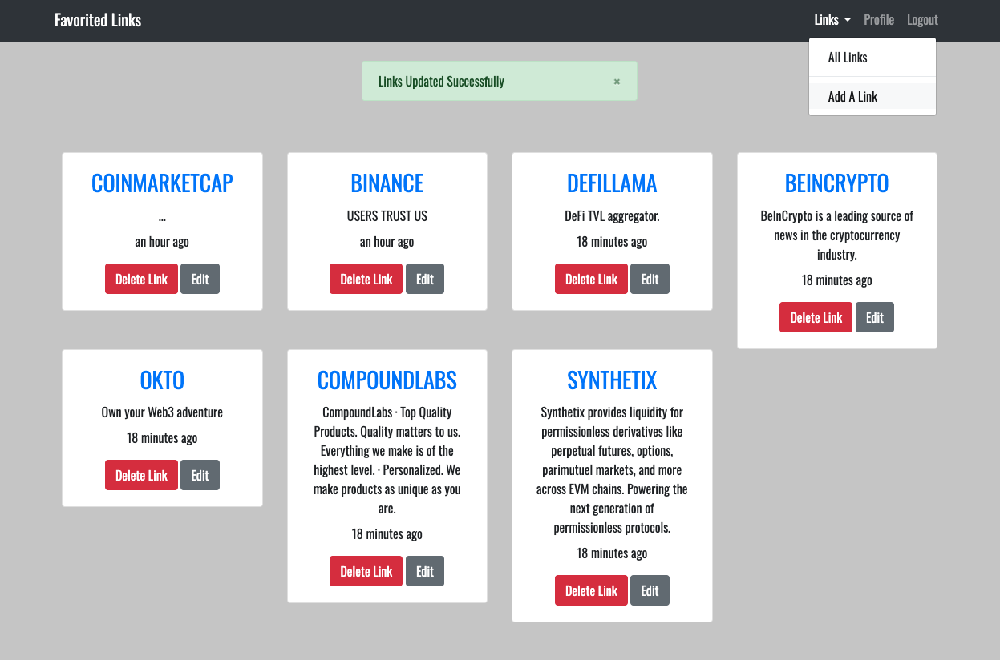
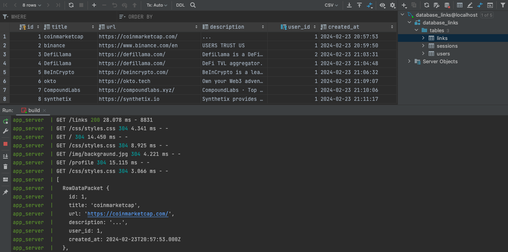

## Intro to NODE.JS MySQL Fav Links application
Welcome to the Fav Links App, powered by Node.js and MySQL database, and deployed using Docker containers!<br> Our application ensures secure data storage with bcryptjs encryption. We're thrilled to present the culmination of our efforts and showcase the seamless integration of these technologies.

## Prerequisite
- Install Docker Engine - [documentation](https://docs.docker.com/engine/install/)
- Create network
```bash
docker network create local
```

## Available Scripts

In the project directory, you can run:

### `npm start`

Runs the stand-alone app in the development mode.<br>
Open [http://localhost:4000](http://localhost:4000) to view it in the browser.

### `npm run start:dev`

Launches the stand-alone app in watch mode with hot reload.

### `npm run build`

Run `docker-compose` to create two separate containers: one for the MySQL database,<br> which automatically sets up all the necessary tables behind the scenes, and another for the application itself.<br> Once completed, your app will be ready to view in the browser!

Application             |  Database
:-------------------------:|:-------------------------:
  |  
